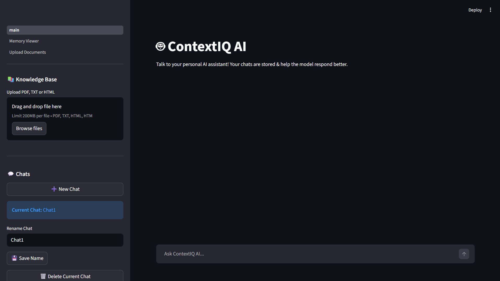
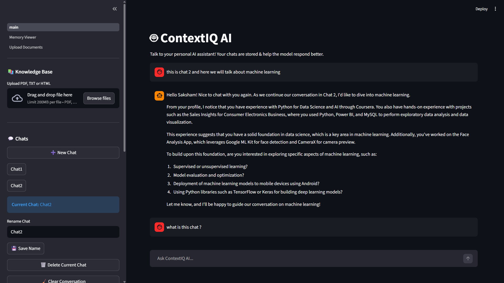
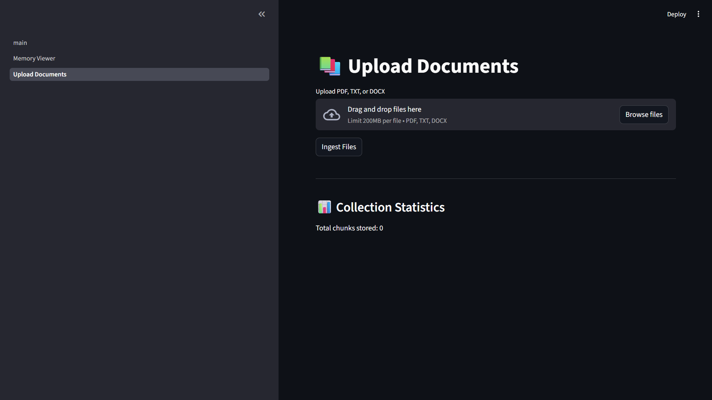
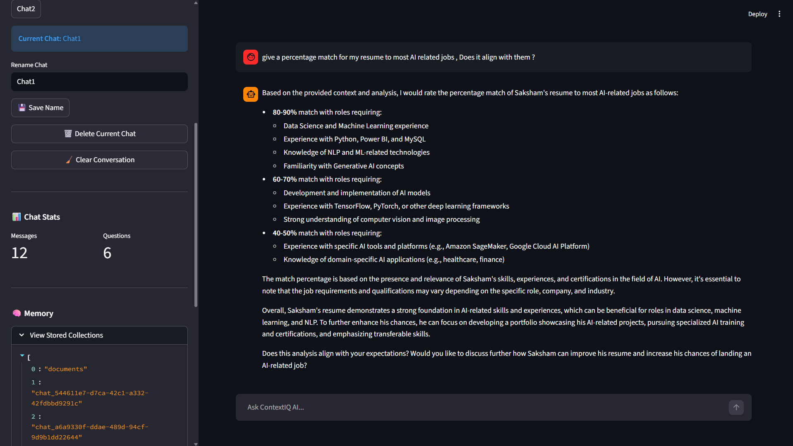

# 🧠 ContextIQ AI — A Context-Aware Retrieval-Augmented AI Assistant

<div align="center">

### *"An AI assistant that doesn't just answer — it remembers, retrieves, and reasons."*


*A production-oriented AI assistant built using Retrieval-Augmented Generation (RAG), semantic search, persistent conversational memory, and document intelligence.*

</div>

---

# ✨ Overview

ContextIQ AI is a **context-aware AI assistant** that combines **Large Language Models (LLMs)** with **Retrieval-Augmented Generation (RAG)** to deliver responses grounded in your own knowledge base instead of relying solely on the model's internal knowledge.

Unlike traditional chatbots that forget previous interactions, ContextIQ AI provides:

* 🧠 Persistent conversational memory
* 📚 Knowledge retrieval from uploaded documents
* 🔍 Semantic vector search
* 💬 Multi-chat conversation management
* ⚡ Fast, context-aware responses

The result is an AI assistant capable of acting as your personal knowledge system.

---

# 🚀 Key Features

### 💬 Multi-Chat Architecture

* Create unlimited conversations
* Switch between chats
* Rename conversations
* Delete chats
* Persistent chat history using SQLite

---

### 📄 Intelligent Document Processing

Supports:

* PDF
* TXT
* HTML

Documents are automatically:

* Extracted
* Chunked
* Embedded
* Indexed into ChromaDB

---

### 🧠 Retrieval-Augmented Generation (RAG)

Instead of generating responses from memory alone:

```
User Question
      │
      ▼
Retrieve Relevant Chunks
      │
      ▼
LLM + Retrieved Context
      │
      ▼
Grounded Response
```

This significantly reduces hallucinations while improving factual accuracy.

---

### 🔎 Semantic Search

Uses Sentence Transformers embeddings together with ChromaDB to retrieve semantically relevant context instead of keyword matching.

---

### 💾 Persistent Memory

ContextIQ remembers:

* Uploaded documents
* Previous conversations
* Chat history
* User context

using:

* SQLite
* ChromaDB

---

### 🖥 Modern Chat Interface

Built with Streamlit featuring:

* Native chat UI
* Document upload
* Chat management
* Context preview
* Memory controls

---

# 🏗 System Architecture

```
                User
                  │
                  ▼
         Streamlit Interface
                  │
                  ▼
          User Query Input
                  │
                  ▼
        Retrieve Context (RAG)
                  │
        ┌─────────┴─────────┐
        ▼                   ▼
   ChromaDB           SQLite Memory
(Vector Database)     (Chat History)
        │                   │
        └─────────┬─────────┘
                  ▼
              LLM (Groq)
                  │
                  ▼
          Context-Aware Response
```

---

# 🛠 Tech Stack

| Category            | Technology                           |
| ------------------- | ------------------------------------ |
| Language            | Python                               |
| Frontend            | Streamlit                            |
| LLM                 | Groq (Llama 3.1)                     |
| RAG                 | Custom Retrieval Pipeline            |
| Vector Database     | ChromaDB                             |
| Embeddings          | Sentence Transformers (MiniLM-L6-v2) |
| Database            | SQLite                               |
| Document Processing | pdfplumber, BeautifulSoup            |
| Version Control     | Git & GitHub                         |

---

# 📸 Screenshots

## 🏠 Home

<p align="center">
  
</p>

---

## 💬 Chat Interface

<p align="center">
  
</p>

---

## 📂 Knowledge Base Upload

<p align="center">
  
</p>

---

## 🔄 Multi Chat Support

<p align="center">
  
</p>

---

# 📈 Project Highlights

✔ Retrieval-Augmented Generation (RAG)

✔ Semantic Vector Search

✔ Persistent Multi-Chat Architecture

✔ SQLite-backed Conversation Storage

✔ ChromaDB Memory System

✔ Modular Python Architecture

✔ Context-Aware AI Responses

✔ Production-Oriented Design

---

# 🚀 Deployment

### Current

* Local Development ✔
* GitHub Repository ✔

### Upcoming

* Render Deployment
* Google Cloud Run Deployment
* Docker Containerization

---

# 🧪 Future Roadmap

* Gemini API integration
* Source citations
* Authentication
* User profiles
* Cloud vector database
* Streaming responses
* Voice interface
* Memory analytics dashboard

---

# ⚙ Installation

```bash
git clone https://github.com/YOUR_USERNAME/ContextIQ-AI.git

cd ContextIQ-AI

python -m venv .venv

source .venv/bin/activate

pip install -r requirements.txt

streamlit run main.py
```

---

# 📚 What I Learned

This project helped me gain practical experience in:

* Retrieval-Augmented Generation (RAG)
* Large Language Model integration
* Prompt engineering
* Semantic search
* Vector databases
* Persistent data storage
* AI application architecture
* Git workflow
* Software engineering best practices

---

# 👨‍💻 Author

**Saksham Sharma**

AI Developer • Android Developer • Software Engineer

> *"I don't just use AI—I engineer intelligent systems."*

---

## ⭐ Support

If you found this project interesting, consider giving it a ⭐ on GitHub.
